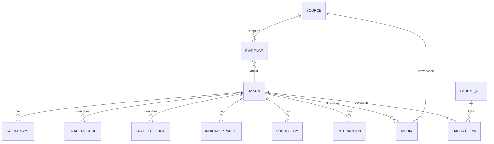
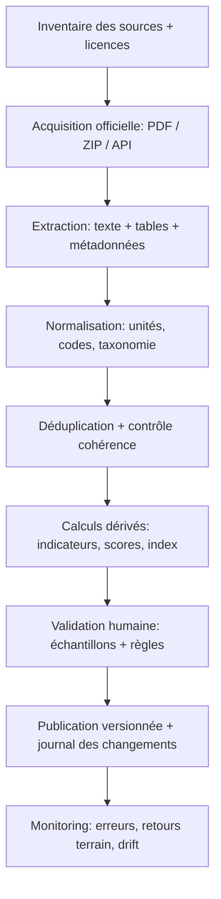
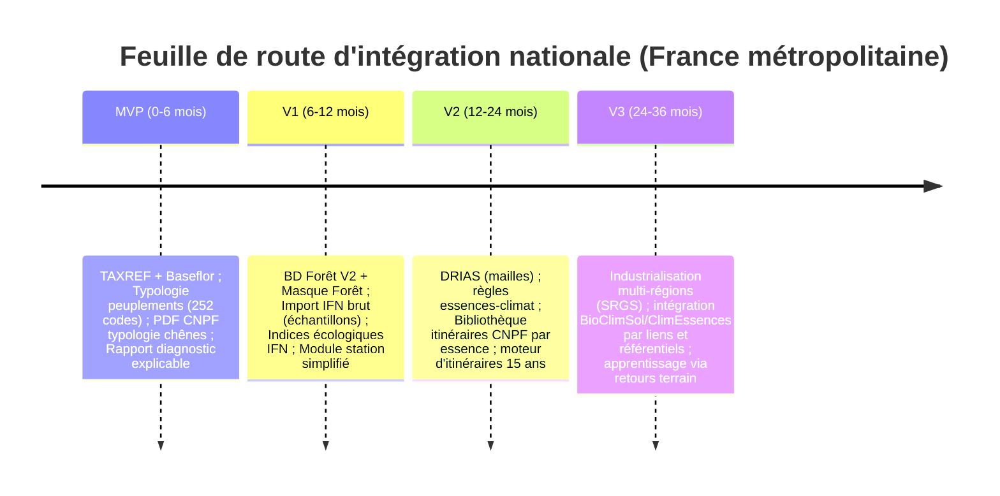

# Base nationale de connaissances forestières pour GeoSylva

## Synthèse exécutive

Votre objectif (France métropolitaine, base « la plus grosse possible ») est réaliste si GeoSylva devient une **base de connaissances** plutôt qu’un simple dépôt documentaire : un référentiel taxonomique national (≈ 5000+ espèces vasculaires), enrichi de traits/indicateurs écologiques, relié à une typologie nationale des peuplements (≥ 250 « structures » via un code systématique), et doté d’un moteur de règles produisant des diagnostics sylvicoles explicables (ex. chênaie issue de taillis sous futaie → conversion → itinéraire 15 ans + martelage). Les briques publiques françaises permettant une couverture nationale existent : taxonomie nationale (TAXREF), données floristiques/indicateurs (Baseflor), classification des végétations (Prodrome), inventaire forestier et géodonnées (BD Forêt, données brutes IFN), projections climatiques (DRIAS), et référentiels/itinéraires sylvicoles (CNPF). citeturn11view3turn11view4turn3search3turn12view0turn11view1turn11view6turn0search0

La contrainte majeure est juridique : **entity["book","Flore forestière française","guide ecologique rameau"]** et **entity["book","Flora Gallica","tison de foucault 2014"]** sont des ouvrages commerciaux/de référence ; sans licence, GeoSylva peut **indexer** (métadonnées, citations, page/référence), **extraire des faits non protégeables** (listes, codes, champs numériques) si droit applicable et conditions respectées, mais ne doit pas reproduire massivement textes, clés, illustrations. Le cœur « 5000+ espèces » peut être construit légalement à partir de références ouvertes (TAXREF + Baseflor + Prodrome + photos sous licences compatibles), tout en gardant les deux ouvrages comme « sources bibliographiques premium ». citeturn2search1turn2search9turn2search4turn11view3turn11view4turn3search3

Enfin, la typologie des peuplements la plus opérationnelle pour automatiser un diagnostic explicable est celle « surface terrière (G) + structure (triangle PB/BM/GB/TGB) », très utilisée en forêt privée et largement documentée en France par des fiches techniques (ex. typologie chênes prépondérants). Elle se prête naturellement à un codage systématique : (régime) × (classe G) × (structure 1..9) ⇒ **252 types** minimaux, auxquels on ajoute des qualificatifs (origine, mélange d’essences, verticalité, régénération, qualité) pour dépasser largement « 250+ » sans perdre l’explicabilité. citeturn9view0turn6view0turn5view1turn1search1

image_group{"layout":"carousel","aspect_ratio":"16:9","query":["Flore forestière française CNPF-IDF couverture","Flora Gallica Biotope couverture","triangle des structures peuplement forestier PB BM GB"],"num_per_query":1}

## Cadre national et contraintes légales

Le périmètre « France métropolitaine » (incluant la Corse) impose de privilégier des sources à **couverture nationale**, à mise à jour régulière et à licences claires :  
- Taxonomie : TAXREF est présenté comme le référentiel taxonomique national pour faune/flore/fonge, diffusé avec une licence ouverte via la plateforme nationale d’open data. citeturn11view3  
- Forêt (cartographie) : la BD Forêt V2 est un référentiel géographique national (32 postes, polygones ≥ 0,5 ha), disponible sur tout le territoire métropolitain, sous licence ouverte Etalab 2.0 depuis 2021. citeturn12view0turn11view0  
- Forêt (inventaire) : les données brutes IFN (placettes, arbres, volets éco‑floristiques) sont publiées via data.gouv et documentées (DataIFN) ; elles portent sur ≈ 6000 placettes/an et ≈ 60 000 arbres/an, avec coordonnées fournies au km près. citeturn11view1turn5view3turn4search25  
- Climat futur : le portail DRIAS met à disposition des données régionalisées (NetCDF/CSV), gratuites, avec conditions d’utilisation (mention des sources, pas d’altération/dénaturation du sens), et nécessite la création d’un compte pour valider ces conditions. citeturn11view6turn1search3  

Pour la flore et la végétation, deux ensembles sont particulièrement utiles et « industrialisables » :  
- Baseflor/Baseveg (données compilées et diffusées via la communauté botanique) sont explicitement proposées au téléchargement, avec licences ODbL (base) et CC BY‑SA (contenu), ce qui est adapté à une base nationale réutilisable (sous réserve de respecter l’attribution et le partage à l’identique selon licence). citeturn11view4turn3search2  
- Le Prodrome des végétations de France (PVF) fournit une structuration phytosociologique hiérarchisée des unités de végétation (jusqu’à un rang élevé dans la hiérarchie), utile comme colonne vertébrale pour « habitats / groupements ». citeturn3search3turn3search32  

Concernant les deux ouvrages de référence :  
- **Flora Gallica** est présentée comme une flore complète pour les plantes vasculaires, coordonnée autour de spécialistes (publication 2014), couvrant le territoire métropolitain. citeturn2search1turn2search9turn2search37  
- La **Flore forestière française** (collection CNPF‑IDF) est une référence orientée « diagnostic écologique de terrain » (clés, vocabulaire, indices) et disponible commercialement en tomes. citeturn2search4turn2search8turn2search20  

Implication légale pour GeoSylva : vous pouvez (et devriez) intégrer **leurs métadonnées**, citations, thèmes, renvois bibliographiques, et des **champs structurés** dérivés (ex. statut forestier, traits codés), mais pas reproduire intégralement clés/textes/illustrations sans accord. citeturn2search1turn2search4  

## Plan de contenu exhaustif et structuré pour la base

Ce plan est une **arborescence « métier »** (réutilisable comme cahier des charges). L’idée est de rendre chaque information **adressable**, **versionnée**, et **corrélable** (espèce ↔ station ↔ habitat ↔ climat ↔ peuplement ↔ itinéraire).

**Niveau racine**
- Référentiels
  - Taxonomie (noms, synonymes, identifiants, rangs)
  - Géographie (maillages nationaux, régions écologiques, départements, mailles DRIAS, mailles IFN)
  - Nomenclatures métier (catégories PB/BM/GB/TGB, types d’humus, classes de sol, codes habitats, codes peuplements)
- Flore (espèces)
  - Identité taxonomique (nom retenu, auteur, rang, parenté)
  - Synonymie & historiques de noms
  - Morphologie (diagnostic terrain)
    - port, tiges, feuilles, fleurs, fruits, organes souterrains
    - caractères différentiels (confusions fréquentes)
    - clés « minifiées » (sous forme de critères structurés, pas de texte reproduit)
  - Chorologie / répartition (France métropolitaine)
    - présence/absence par mailles (observations)
    - incertitudes / données anciennes
    - statuts (indigène/introduite/naturalisation/rare/protégé)
  - Autécologie (exigences et tolérances)
    - lumière, humidité, trophie, acidité/calcaire, texture/structure sol
    - température/continentalité, altitude, exposition
    - tolérances aux stress (sécheresse, hydromorphie, gel, chaleur)
  - Indicateurs stationnels (bio‑indication)
    - valeurs de type Ellenberg/Julve (humidité édaphique, trophie, pH, lumière, etc.)
    - appartenance phytosociologique (classe/ordre/alliance/association quand disponible)
    - espèce « indicatrice forte / moyenne / faible »
  - Habitats & groupements
    - rattachement PVF / référentiels phytosociologiques
    - correspondances éventuelles (Natura 2000/EUNIS si vous l’ajoutez)
  - Phénologie
    - périodes floraison/fructification/végétation
    - cycle biologique (annuelle, vivace, etc.)
  - Interactions
    - pollinisation / dissémination
    - mycorhizes (si données)
    - rôle trophique/faune (plante hôte, ressource)
  - Valeur forestière (angle sylvicole)
    - rôle dans la station (sous‑bois, lisière, pionnière)
    - intérêt pour diagnostic stationnel
    - effets potentiels sur régénération (compétition, couvre‑sol, indicateurs de perturbation)
  - Vulnérabilités & pressions
    - sensibilité au tassement, perturbation, pâturage, incendie (si connu)
- Peuplements (typologie & diagnostics)
  - Régime / traitement
    - futaie, taillis, mélange futaie‑taillis, taillis sous futaie (TSF)
  - Structure diamétrique (triangle PB/BM/GB/TGB)
  - Capital / richesse (surface terrière, volume estimé)
  - Composition (pure/mélangée, proportion d’essences)
  - Origine (plantation, régénération naturelle, rejets de souche)
  - Verticalité (mono/bistrate/pluristrate)
  - Stade (régénération, gaulis, perchis, PB, BM, GB, TGB)
  - Dynamiques (conversion, régularisation, irrégularisation, dépérissement)
  - Règles de classification automatiques + explications
- Sylviculture (itinéraires & règles)
  - Itinéraires par essence/objectif/contexte
  - Règles de martelage (sélection arbres d’avenir, prélèvements)
  - Programmes de coupes & travaux (horizon 5/10/15/30 ans)
  - Hypothèses de productivité et incertitudes
- Climat & bioclimat (national)
  - climat observé (si vous l’intégrez via sources ouvertes)
  - climat futur (DRIAS, TRACC si vous vous alignez)
  - indices utiles forêt (déficit hydrique, extrêmes)
  - compatibilités essences‑climat (liens vers outils)
- Sources & preuves
  - Bibliographie (ouvrages, guides)
  - Documents PDF officiels (liens, versions, pages, périmètres)
  - Jeux de données (licences, schémas, millésimes)
  - Historique de versions (ce qui a changé, quand, pourquoi)
- Métadonnées transverses (obligatoire partout)
  - source, date de validité, licence, niveau de confiance
  - granularité spatiale (national/régional/local)
  - méthode d’obtention (mesure terrain, calcul, extraction doc, import API)
  - traçabilité des transformations (pipeline)

Ce plan s’appuie explicitement sur des briques nationales disponibles (TAXREF, BD Forêt, données IFN, DRIAS, Baseflor/Baseveg, Prodrome, guides techniques CNPF). citeturn11view3turn12view0turn11view1turn11view6turn11view4turn3search3turn0search0  

## Référentiel espèces 5000+ et modèle de données

### Sources structurantes « espèces »
Pour atteindre « 5000+ » de manière robuste et légale, une approche efficace est :
- **Backbone taxonomique** : TAXREF (identifiant stable, synonymes, structuration) – base nationale. citeturn11view3  
- **Traits/indicateurs écologiques** : Baseflor (index botanique/écologique/chorologique, valeurs écologiques, etc.) avec licences explicitement publiées. citeturn3search2turn11view4  
- **Groupements/habitats** : Prodrome des végétations de France + Baseveg pour rattachements phytosociologiques/structures de végétations (selon disponibilité et licence). citeturn3search3turn11view4  
- **Couches forestières** : relevés éco‑floristiques et indices écologiques issus de l’inventaire forestier peuvent aider à calibrer « flore forestière » à l’échelle nationale (présence/association avec types forestiers). citeturn11view2turn11view1  

### Champs recommandés par espèce : liste exhaustive des champs
Ci‑dessous, les champs à prévoir **par taxon** (un taxon = espèce, sous‑espèce, etc.). L’exhaustivité recherchée se joue surtout dans (i) la traçabilité, (ii) la capacité à stocker de l’incertitude, (iii) la normalisation.

**Identité & taxonomie**
- taxon_id_interne (UUID)
- taxref_cd_ref, taxref_cd_nom (ou équivalent)
- rang_taxonomique (espèce, sous‑espèce, variété…)
- nom_scientifique_complet
- auteur_nom
- famille, ordre, classe (liens vers taxons parents)
- statut_taxonomique (accepté/synonyme/misappliqué)
- liste_synonymes (table liée)
- nom_fr_principal
- noms_vernaculaires (liste)
- codes de correspondance (si disponibles) : BDTFX/BDTFX‑like, etc. (table de correspondance)

**Morphologie (diagnostic terrain)**
- forme_de_vie (arbre/arbuste/herbacée/liane/mousse/ptéridophyte…)
- type_biologique (phanérophyte, hémicryptophyte…)
- hauteur_min/typique/max
- port (dressé, rampant, etc.)
- feuilles (type, insertion, marge, nervation, persistance)
- fleurs (type, couleur, sexualité, inflorescence)
- fruits (type, période, caractères)
- racines/rhizomes (type)
- caractères_diagnostiques_structurés (liste de critères)
- confusion_avec (liens vers taxons)

**Chorologie / répartition**
- aire_mondiale (texte structuré + réf)
- présence_france_metropole (booléen)
- répartition_par_grandes_régions_biogéo (liste)
- mailles_occurrence (liens vers table occurrence par grille)
- rareté (commune/peu commune/rare/…)
- tendance (si dispo)
- statut_indigène/introduite/naturalisée/cultivée
- statuts_protection (national/régional) (si sources)

**Autécologie (valences/tolérances)**
- lumière_optimum, lumière_tolérance (échelles)
- humidité_optimum, humidité_tolérance
- trophie_optimum, trophie_tolérance
- pH_optimum, calcarophilie
- texture_sol_preferée (liste)
- hydromorphie_tolérée
- salinité_tolérée
- altitude_min/opt/max
- macroclimat_preferé (océanique/continental/montagnard/méditerranéen…)
- tolérance_sécheresse, tolérance_chaleur, tolérance_gel (échelles)
- perturbation_affinité (rudéralité, coupe, chablis, etc.)

**Indicateurs stationnels**
- valeurs_ecologiques_baseflor (lumière, humidité édaphique, trophie, réaction/pH, température, continentalité…)
- importance_indicatrice (forte/moyenne/faible) (champ calculé)
- diagnostic_stationnel_contrib (poids par facteur) (champ calculé)
- signatures (ex. acidiphile/hygrophile/nitrophile…) (tags)

**Habitats & groupements**
- rattachement_PVF (classe/ordre/alliance/sous‑alliance) (liens)
- rattachements_baseveg (liens)
- habitats_forestiers_typiques (liste)
- habitats_secondaires (liste)

**Phénologie**
- floraison_debut/fin (mois)
- fructification_debut/fin
- période_vegetative (mois)
- stratégie_reproduction (sexuée/végétative)
- banque_de_graines (si info)
- longévité_classe

**Interactions**
- mode_pollinisation
- mode_dissémination
- mycorhize_type (si connu)
- interactions_faune (hôte, ressource)
- espèces_associées_fréquentes (liens)

**Valeur forestière (spécifique GeoSylva)**
- rôle_dans_sous_bois (ombrophile, compétitrice…)
- indicateur_de_station_forestière (oui/non + raisons)
- impact_regeneration_arbrée (facilitateur/compétiteur/neutre)
- intérêt_biodiversité (support, nectar, etc.)

**Vulnérabilités**
- sensibilité_tassement
- sensibilité_pâturage/abroutissement
- sensibilité_incendie
- sensibilité_coupes (espèce de lisière, etc.)
- bioagresseurs_associes (liens)

**Médias & clés**
- photos (URLs + licence + auteur + source)
- illustrations (si licence)
- clés_identification_structurées (micro‑clé) (sans reproduire le texte protégé)
- documents_associes (liens vers PDFs, pages, citations)

**Métadonnées & preuve**
- sources_bibliographiques (liens)
- source_principale_par_bloc (taxo/morpho/eco…)
- date_mise_a_jour
- version
- licence
- niveau_confiance_global (calculé)
- couverture (France entière vs régionale)

### Tables et relations recommandées
L’objectif est d’avoir un modèle **normalisé** (évite duplication) mais pragmatique (performance).  

**Tableau récapitulatif — champs par table (flore)**

| Table | Objet | Champs clés (exemples) |
|---|---|---|
| taxon | unité taxonomique | taxon_id, cd_ref, rang, nom_scientifique, auteur, parent_id, statut |
| taxon_name | noms, synonymes, vernaculaires | taxon_name_id, taxon_id, type_nom, libellé, langue, source_id |
| trait_morpho | morphologie structurée | trait_id, taxon_id, forme_vie, port, feuilles_json, fleurs_json, fruits_json |
| trait_ecologie | autécologie/valences | trait_id, taxon_id, lumière, humidité, trophie, pH, altitude_min/max, tags |
| indicator_value | valeurs indicatrices | ind_id, taxon_id, système (Baseflor/Ellenberg…), facteurs, version, source_id |
| habitat_link | lien taxon ↔ habitat/groupement | link_id, taxon_id, habitat_id, rôle (caractéristique/compagne), poids |
| habitat_ref | référentiel habitats/groupements | habitat_id, système (PVF/Baseveg…), code, libellé, rang, parent_id |
| phenology | phénologie | phen_id, taxon_id, floraison_debut/fin, fructif_debut/fin |
| interaction | relations biotiques | inter_id, taxon_id, type, cible, preuve |
| media | photos/illustrations | media_id, taxon_id, url, licence, auteur, source_id |
| source | sources | source_id, type (pdf/dataset/site), titre, organisme, date, licence, url, hash |
| evidence | preuve fine | evidence_id, objet_type, objet_id, source_id, page/section, note |
| version_log | historisation | version_id, objet_type, objet_id, timestamp, changement, auteur |

Les références « ouvertes » pour construire ces tables (TAXREF, Baseflor/Baseveg, Prodrome) sont explicitement disponibles et documentées en France métropolitaine, ce qui sécurise la couverture nationale. citeturn11view3turn11view4turn3search3turn3search2  

### Diagramme entité‑relation simplifié


## Typologie complète des peuplements (≥250 types) avec codes, critères, règles

### Fondations documentées en France
La méthode « typologie = richesse (surface terrière) + structure (répartition PB/BM/GB/TGB) » est explicitée dans des fiches techniques :  
- Le type est déterminé par deux clés : **clé de surface terrière (G)** pour le chiffre des dizaines, et **clé des structures** pour le chiffre des unités. citeturn6view0turn9view0  
- Le « triangle des structures » utilise %PB (axe horizontal) et %GB (axe vertical), et %BM = 100 − %PB − %GB. Les structures proches des axes correspondent à une dominance d’une seule catégorie (plutôt régulière), tandis que l’éloignement indique coexistence de catégories (plutôt irrégulière). citeturn6view0  
- Les classes de diamètre PB/BM/GB/TGB (au moins pour feuillus) et la logique de comptage (12–20 tiges dans un cercle) sont décrites. citeturn9view0turn5view1  

### Codes de peuplements : un système à 252 types minimaux (et extensible)
Pour atteindre **≥250 types** de peuplements sans perdre l’explicabilité, on peut définir un code national minimal :

**TypeCode = PréfixeRégime + (ClasseCapital × Structure)**

- PréfixeRégime (4 valeurs)  
  - **F** = futaie (franc‑pied dominant)  
  - **M** = mélange futaie‑taillis (deux sous‑peuplements à décrire)  
  - **T** = taillis (rejets/drageons dominants)  
  - **R** = régénération/jeunes stades non précomptables (gaulis/perchis)  

- ClasseCapital (dizaine) = classe de surface terrière G (0..6 + cas 00)  
- Structure (unité) = 1..9 selon triangle PB/BM/GB/TGB  

Ainsi, 4 × 63 = **252 types**, auxquels vous rattachez des **qualificatifs** (composition, origine plantation, verticalité, maturité taillis, qualité, station). La mécanique « 252 types » est directement dérivée du principe « type = (surface terrière) + (structure) » documenté. citeturn6view0turn9view0turn5view1  

### Critères mesurables requis

**Surface terrière (G) et classes de capital (CNPF)**
La clé ci‑dessous est explicitement donnée pour déterminer le chiffre des dizaines (classe de richesse) avec une jauge d’angle : citeturn9view0  

| ClasseCapital | Intervalle G (m²/ha) | Interprétation opérationnelle |
|---:|---:|---|
| 00 / 00B | G < 2 | cas « non balivable / balivable » (très faible capital) |
| 0 | 2 < G < 5 | faible |
| 1 | 5 < G < 10 | faible à moyen |
| 2 | 10 < G < 15 | moyen |
| 3 | 15 < G < 20 | moyen à fort |
| 4 | 20 < G < 25 | fort |
| 5 | 25 < G < 30 | fort |
| 6 | G > 30 | très fort |

**Catégories diamétriques PB/BM/GB/TGB**
En forêt privée, on retrouve couramment les seuils feuillus suivants (PB 17,5–27,5 ; BM 27,5–47,5 ; GB > 47,5 ; TGB > 67,5), et pour résineux (BM jusqu’à 42,5 ; GB > 42,5 ; TGB > 62,5) dans des documents techniques français. citeturn9view0turn13search10turn13search12  

| Groupe | PB | BM | GB | TGB |
|---|---|---|---|---|
| Feuillus (usage courant) | 17,5–27,5 | 27,5–47,5 | >47,5 | >67,5 |
| Résineux (usage courant) | 17,5–27,5 | 27,5–42,5 | >42,5 | >62,5 |

**Structure (1..9) — règles explicites**
Une clé régionale détaillée illustre une définition utilisable en règles : structure déterminée par % en nombre de PB/BM/GB/TGB sur essences nobles précomptables (DHP > 17,5 cm) et conditions de seuils. citeturn5view1turn9view0  

| Structure | Nom (résumé) | Critères mesurables (exemple de règles) |
|---:|---|---|
| 1 | PB dominants | PB > 50% et GB/TGB ≤ 5% |
| 2 | PB dominants + GB épars | PB > 50% et GB/TGB ≤ 20% (avec présence non nulle de GB) |
| 3 | PB + BM dominants | PB ≤ 50% et BM significatif, GB/TGB faible à modéré |
| 4 | BM dominants | BM > 50% |
| 5 | PB + GB dominants | 20% < GB/TGB < 50% et BM ≤ 25% |
| 6 | Sans catégorie dominante | 20% < GB/TGB < 50% et BM > 25% et PB ≥ 25% |
| 7 | BM + GB dominants | 20% < GB/TGB < 50% et PB < 25% |
| 8 | GB dominants | GB/TGB ≥ 50% et %TGB < %GB |
| 9 | TGB dominants | GB/TGB ≥ 50% et %TGB ≥ %GB |

> Remarque importante : GeoSylva doit permettre d’encoder « structure » sur **deux bases** : (i) % en nombre de tiges, (ii) % en surface terrière/volume (optionnel), car les interprétations diffèrent. L’exemple de typologie chêne insiste sur le triangle en **nombre de tiges** et l’usage de catégories de grosseur pour qualifier régularité/irrégularité. citeturn6view0turn9view0  

### Tableau comparatif des 63 types (matrice) et extension à 252
La matrice ci‑dessous donne les **63 types** (dizaines = ClasseCapital ; unités = Structure). Les mêmes 63 existent pour chaque préfixe (F/M/T/R) ⇒ 252.

| ClasseCapital \ Structure | 1 | 2 | 3 | 4 | 5 | 6 | 7 | 8 | 9 |
|---:|---:|---:|---:|---:|---:|---:|---:|---:|---:|
| 0 | 01 | 02 | 03 | 04 | 05 | 06 | 07 | 08 | 09 |
| 1 | 11 | 12 | 13 | 14 | 15 | 16 | 17 | 18 | 19 |
| 2 | 21 | 22 | 23 | 24 | 25 | 26 | 27 | 28 | 29 |
| 3 | 31 | 32 | 33 | 34 | 35 | 36 | 37 | 38 | 39 |
| 4 | 41 | 42 | 43 | 44 | 45 | 46 | 47 | 48 | 49 |
| 5 | 51 | 52 | 53 | 54 | 55 | 56 | 57 | 58 | 59 |
| 6 | 61 | 62 | 63 | 64 | 65 | 66 | 67 | 68 | 69 |

Interprétation standard :  
- **F27** = futaie, G entre 10 et 15 m²/ha, structure « BM+GB dominants » (structure 7). Exemple de lecture « type 27 » explicitement donné. citeturn6view0turn7view0  
- **M22** = mélange futaie‑taillis, réserve décrite comme type 22, taillis décrit séparément (âge, exploitabilité, densité). La séparation « mélange futaie‑taillis = deux sous‑peuplements à décrire » est cohérente avec les documents de description des peuplements qui demandent de distinguer réserve et taillis. citeturn13search3turn1search30  

## Règles et algorithmes pour la corrélation et la génération de diagnostics

### Positionnement dans le triangle des structures
Le calcul de base est explicitement documenté : %PB et %GB suffisent ; %BM se déduit. citeturn6view0  

**Données d’entrée minimales**
- comptage de tiges précomptables par classe PB/BM/GB/TGB (au moins PB/BM/GB)
- ou bien liste d’arbres avec DHP permettant de classer automatiquement

**Sorties attendues**
- coordonnées (x = %PB ; y = %GB)  
- %BM calculé = 100 − %PB − %GB  
- « régularité » (proche des axes) vs « irrégularité » (coexistence)

Pseudo‑code (exprimable en règles GeoSylva) :
```pseudo
PB_pct = 100 * PB_count / N_precomptable
GB_pct = 100 * GB_count / N_precomptable
BM_pct = 100 - PB_pct - GB_pct

# distance aux axes = indicateur simplifié de dominance
dist_to_PB_axis = abs(GB_pct)          # proche de 0 => dominance PB/BM
dist_to_GB_axis = abs(PB_pct)          # proche de 0 => dominance GB/TGB

if (PB_pct > 70 or GB_pct > 70 or BM_pct > 70):
    structure_mode = "dominance forte (plutôt régulière)"
else:
    structure_mode = "coexistence (plutôt irrégulière)"
```

### Évaluation richesse / structure / type (ex. PB)
- Richesse via classe de G (clé surface terrière). citeturn9view0  
- Structure via règles 1..9 (triangle). citeturn5view1turn6view0  
- Type = concaténation (dizaine, unité). citeturn6view0turn9view0  

Pseudo‑code « type » :
```pseudo
# 1) ClasseCapital
if G < 2:
  capital = "00"  # et qualifier balivable/non balivable selon règles métier
elif 2 < G < 5: capital = "0"
elif 5 < G < 10: capital = "1"
elif 10 < G < 15: capital = "2"
elif 15 < G < 20: capital = "3"
elif 20 < G < 25: capital = "4"
elif 25 < G < 30: capital = "5"
else: capital = "6"

# 2) Structure 1..9 (extrait de règles)
if PB_pct > 50 and GTGB_pct <= 5: structure = "1"
elif PB_pct > 50 and GTGB_pct <= 20: structure = "2"
...
type_code = capital + structure
```

### Diagnostic régime/traitement (TSF → conversion)
Un diagnostic fiable nécessite des indices d’origine des tiges : présence de cépées/rejets et présence d’arbres de réserve (baliveaux, modernes, anciens). La définition du taillis sous futaie (TSF) comme coexistence d’un taillis simple et d’une futaie de réserves (baliveaux/modernes/anciens) est rappelée dans un document CNPF sur le mélange futaie‑taillis issu des TSF. citeturn1search30  

Règles pratiques (exprimables en moteur de diagnostic) :
- **TSF probable** si :  
  - taux de tiges « multi‑brins / cépées » important **ET**  
  - présence d’arbres de réserve (diamètres plus forts, franc‑pied)  
- **Conversion en cours** si :  
  - baisse progressive des composantes « cépées d’exploitation »  
  - montée d’une essence objectif en franc‑pied  
  - structure se déplace dans le triangle vers une dominance de catégories de futaie  
- **Abandon/absence d’entretien du TSF** si :  
  - taillis vieilli, concurrence forte, absence de rotation régulière du taillis  
  - manque d’arbres d’avenir bien répartis

### Proposition d’objectif long terme
L’objectif long terme doit être généré à partir d’un faisceau de variables (qualité, potentiel, station/climat, structure). Les fiches CNPF de typologie explicitent que l’outil sert à orienter l’itinéraire, et qu’il est utile de saisir des données complémentaires (station, régénération, perches/semis, qualité, taillis) pour décider. citeturn7view2turn6view4  

Heuristique robuste (explicable à l’utilisateur) :
- si qualité « arbres d’avenir » suffisante et régénération possible → viser production bois d’œuvre (régulier ou irrégulier selon structure/objectif)
- si qualité faible / essence non adaptée → objectif de renouvellement (changement d’essence, mélange, conversion, irrégularisation) avec justification

### Génération d’itinéraires sylvicoles (ex. 15 ans) et martelage
La typologie « chênes prépondérants » fournit des orientations par zones (liées à la structure), par exemple : zone « petits bois dominants et gros bois épars » → conversion en futaie régulière (éclaircie d’amélioration dans PB + prélèvement des bois mûrs) ou conversion en irrégulier (éclaircie d’amélioration PB/perches, coupe sanitaire sur GB). citeturn5view0turn6view4  

Le programme de martelage doit être la traduction « arbre par arbre » d’un objectif de structure et de qualité, avec une règle simple : enlever dominés/défauts/concurrents des arbres d’avenir, et calibrer l’intensité en % de tiges et/ou % de surface terrière, en restant progressif en conversion (éviter ruptures). Les documents CNPF insistent aussi sur la nécessité d’un diagnostic et l’usage d’inventaires/typologies pour orienter la gestion vers l’irrégulier. citeturn1search4turn5view0turn13search8  

#### Exemple formel en règles (pseudo‑règles)
```pseudo
# Entrées: liste d'arbres avec (dbh, essence, qualité, vigueur, origine, statut_compétiteur, position_couronne)
# Paramètres: objectif = "conversion vers futaie régulière chêne", intensité_G = 3 m2/ha, cycle = 8-10 ans

# 1) Sélection arbres d'avenir
avenir = arbres
  .filter(essence == "chêne sessile")
  .filter(dbh in [25..55])
  .filter(qualité >= 3/5)
  .filter(vigueur >= 3/5)
  .pick_best_spatially(target=80..120 /ha)

# 2) Marquage d'enlèvement (priorités)
a_enlever = []
for each tree in arbres:
  if tree in avenir: continue
  if tree.vigueur < 2/5 or tree.sanitaire == "déperissant": a_enlever.add(tree); continue
  if tree.concurre_un(avenir) and tree.qualité < avenir.qualité: a_enlever.add(tree); continue
  if tree.origine == "cépee" and tree.concurre_un(avenir) and tree.qualité faible: a_enlever.add(tree); continue

# 3) Calage intensité
while surface_terriere_prelevee(a_enlever) > intensité_G:
  retirer_dernier(a_enlever, critère="moins_prioritaire")

# 4) Sortie explicable
produire_rapport(motifs_par_arbre, bilan_G, bilan_N, impact_structure_triangle)
```

### Cas complet : chênaie issue de TSF → conversion → itinéraire 15 ans + martelage

**Entrées (inventaire typologique minimal)**
- Essence dominante : chêne (prépondérant)  
- G mesurée à la jauge d’angle : 8–10 m²/ha (exemple)  
- Comptage 12–20 tiges précomptables (DHP > 17,5 cm) et répartition PB/BM/GB  
- Présence de cépées + réserves, indicant un héritage TSF  
- Données complémentaires (recommandées) : régénération, nombre de perches d’avenir, qualité des PB/BM/GB, station

**Étape typologie**
- ClasseCapital = 1 si 5 < G < 10 m²/ha (ou 2 si 10–15, selon mesure). citeturn9view0  
- Structure = PB dominants + GB épars si PB > 50% et GB/TGB ≤ 20%. citeturn5view1  
- Type = 12 (si capital 1, structure 2) ; interprétation « petits bois dominants + gros bois épars ». citeturn6view0turn9view0  

**Position dans le triangle**
- x = %PB, y = %GB ; %BM déduit ; conclusion « dominance PB avec un peu de GB ». citeturn6view0  

**Diagnostic régime/traitement**
- TSF initial probable (taillis + réserves) : définition et logique documentées. citeturn1search30  
- Évolution actuelle : si le taillis n’est plus recépé et que la réserve se renforce → conversion vers futaie (régulière ou irrégulière) possible.

**Orientation de gestion (base CNPF typologie chêne)**
- Pour la zone « petits bois dominants et gros bois épars », la fiche propose :  
  - conversion en futaie régulière : éclaircie d’amélioration dans PB + prélèvement des bois mûrs,  
  - ou conversion en futaie irrégulière : éclaircie d’amélioration PB/perches + coupe sanitaire sur gros bois sur semis acquis. citeturn5view0turn6view4  

**Objectif long terme (exemple cohérent)**
- Production de bois d’œuvre de chêne, en conversion progressive (objectif « futaie régulière » si qualité homogène et régénération gérable).  
- Paramètres cibles (à configurer par SRGS/zone) : diamètre d’exploitabilité, densité finale, qualité visée. Les SRGS encadrent généralement rotations et taux de prélèvement (à intégrer par région). citeturn10search27turn10search14  

**Itinéraire 15 ans généré (structure « conversion prudente »)**
GeoSylva peut reprendre votre logique (3 interventions) en l’adossant à la recommandation « éclaircies d’amélioration » documentée pour cette zone. citeturn5view0turn6view4  

- Année 0 : éclaircie de conversion prudente  
  - retirer dominés, défauts, cépées concurrentes autour des arbres d’avenir  
  - intensité : calibrer en % tiges et surtout en G (ex. 2–4 m²/ha selon contexte), puis vérifier la structure obtenue (triangle avant/après)  
- Année 8–10 : éclaircie d’amélioration  
  - libérer houppiers des arbres d’avenir, poursuivre sélection  
- Année 15 : éclaircie de structuration  
  - renforcer hiérarchie, préparer phase suivante

**Martelage prochaine coupe (sortie « arbre par arbre »)**
- Marquer en priorité :  
  - arbres dépérissants / instables  
  - concurrents directs des arbres d’avenir sélectionnés  
  - tiges mal conformées (fourches, grosses blessures)  
  - cépées dominantes bloquant la réserve  
- Conserver :  
  - arbres d’avenir bien répartis  
  - quelques arbres habitats (si module biodiversité activé)  
- Explications obligatoires : pour chaque arbre marqué, GeoSylva renvoie « motif » (concurrence, défaut, sanitaire, objectif structure) et l’impact sur N/ha, G, et triangle.

## Données d’inventaire, sources prioritaires, pipeline d’ingestion et feuille de route

### Données d’inventaire nécessaires (formats, unités, seuils)
Deux niveaux, complémentaires :

**Inventaire typologique (rapide, “terrain‑friendly”) — aligné CNPF**
- Point/placette (id, date, opérateur, GPS)
- Mesure G à la jauge d’angle (m²/ha) sur arbres DHP > 17,5 cm (chiffre des dizaines) citeturn9view0  
- Comptage 12–20 tiges dans un cercle (rayon ajusté) et répartition PB/BM/GB/TGB (en nombre) (chiffre des unités) citeturn9view0turn5view1  
- Variables additionnelles conseillées (explicitement mentionnées comme pertinentes dans la typologie chêne) : station, régénération, perches/semis, qualité, taillis. citeturn6view4turn7view2  

**Inventaire dendrométrique (analytique)**
- Arbre (id, essence, DHP cm, hauteur m si disponible, qualité, vigueur, origine franc‑pied/cépée, statut sanitaire)
- Placette (surface/expansion à l’hectare)
- Sorties calculables : N/ha, G, Dg, distribution de diamètres, volumes (avec tarifs)  
La documentation IGN rappelle que certaines variables comme le volume sont calculées à partir de données brutes et de tarifs, ce qui conforte l’idée « mesures brutes + modèles ». citeturn5view3  

**Exemple de formulaire “placette typologique” (structure)**
- Identité : parcelle, sous‑zone, point, GPS  
- Mesures : G (m²/ha), N_precomptable, PB/BM/GB/TGB (%)  
- Régénération : semis/gaulis (0/1/2/3), essence(s)  
- Taillis : âge estimé, maturité, densité (qualitative)  
- Qualité par classe (PB, BM, GB) : 1–5  
- Observations stationnelles synthétiques : pente, exposition, humidité, profondeur apparente

### Sources prioritaires à ingérer (France métropolitaine) et nature des données

**Taxonomie et flore**
- **entity["organization","Muséum national d'Histoire naturelle","paris, fr"]** / TAXREF (jeu national via data.gouv) : backbone des noms et identifiants. citeturn11view3  
- **entity["organization","Tela Botanica","montpellier, fr"]** : Baseflor/Baseveg (licences annoncées) pour indicateurs écologiques et phytosociologie. citeturn11view4turn3search2  
- Prodrome des végétations de France (référentiel national de végétations) pour groupements/habitats. citeturn3search3turn3search32  

**Forêt & géodonnées**
- **entity["organization","Institut national de l'information géographique et forestière","saint-mande, fr"]** : BD Forêt V2 (nomenclature 32 postes, polygones ≥ 0,5 ha, licence ouverte Etalab 2.0) + Masque Forêt. citeturn12view0turn11view0turn12view1  
- Données brutes IFN (placettes/arbre/éco‑floristique), diffusées via data.gouv + DataIFN (doc, mises à jour). citeturn11view1turn4search25turn5view3  
- Indices écologiques IFN (≈ 100 000 placettes avec relevé écologique depuis 2005, jeu publié sous licence ouverte). citeturn11view2  

**Climat**
- **entity["organization","Meteo-France","toulouse, fr"]** : DRIAS (données régionalisées, NetCDF/CSV, conditions d’utilisation). citeturn11view6turn1search3  
- Documentation technique DRIAS (grille ≈ 8 km, jeux d’indicateurs) : utile pour la traçabilité des mailles et du calcul bioclimatique. citeturn1search31turn1search20  

**Sylviculture et diagnostics**
- **entity["organization","Centre national de la propriete forestiere","paris, fr"]** : fiches techniques et itinéraires par essence (PDF), guides stations, typologies (dont chênes prépondérants). citeturn0search0turn0search13turn1search1turn9view0  
- Outils sylvoclimatiques :  
  - **entity["organization","ClimEssences","outil onf cnpf, fr"]** (aide au choix d’essences en contexte climatique). citeturn4search4turn4search10  
  - BioClimSol (diagnostic sylvo‑climatique parcellaire, explicitation des modules). citeturn4search5turn4search0turn4search28  

> Stratégie recommandée : ingérer **les PDF officiels CNPF/IGN/DRIAS** comme documents versionnés + extraire des **données structurées** (tables, seuils, clés) quand c’est autorisé, et relier le reste par citations/renvois. Les pages CNPF listent explicitement des PDF disponibles (stations, fiches). citeturn0search13turn0search0turn8search5  

### Stratégies d’extraction (PDF, OCR, structuration) et conformité
- PDF numériques officiels (CNPF, IGN, DRIAS) : extraction texte + tableaux, conservation du PDF original, empreinte (hash) et version. citeturn0search13turn12view0turn11view6  
- OCR : réservé aux scans et uniquement si licence/cadre d’utilisation le permet.  
- Ouvrages commerciaux (Flore forestière française, Flora Gallica) : indexation bibliographique + citations/page‑repères + champs dérivés (tags, scores) sans reproduction massive, sauf licence. citeturn2search1turn2search4  
- Validation humaine : indispensable pour (i) clés de détermination, (ii) règles sylvicoles, (iii) cartographie stationnelle, car le risque d’erreur sémantique est élevé.

### Pipeline d’ingestion et QA


**Contrôles QA minimaux**
- Taxonomie : tout nom entrant doit résoudre vers un identifiant TAXREF (ou être flagged). citeturn11view3  
- Licences : chaque objet doit porter source/licence et contraintes (ex. DRIAS : gratuit mais conditions de non‑altération/dénaturation et attribution). citeturn11view6  
- Règles typologie : tests unitaires sur cas connus (exemples fournis dans fiches CNPF : type “27”, exemples de zones, etc.). citeturn6view0turn6view4  
- Données IFN : garder en tête que les coordonnées sont au km près et que les données brutes ne permettent pas de recalculer des résultats d’inventaire sans poids/statification (si objectif statistique). citeturn11view1turn5view3  

### Priorités d’intégration par phases (MVP → 1–3 ans)


### Tables récapitulatives exigées

**Relations clés (extrait)**
| Relation | Clé | Pourquoi |
|---|---|---|
| taxon ↔ indicator_value | taxon_id | diagnostic stationnel (bio‑indication) |
| taxon ↔ habitat_ref | taxon_id + habitat_id | rattachement groupements/habitats |
| plot ↔ tree | plot_id | diagnostics peuplements + martelage |
| plot ↔ stand_type | plot_id | typologie & explication |
| stand_type ↔ silviculture_rule | type_code | itinéraire et intensité par type |
| grid_climate ↔ plot | maille_id | bioclimat et risques |
| source ↔ (tout) | source_id | traçabilité / audit |

**Priorités d’intégration (extrait)**
| Composant | Valeur MVP | Valeur à 1–3 ans | Source nationale |
|---|---|---|---|
| Taxonomie | indispensable | stable | TAXREF citeturn11view3 |
| Indicateurs flore | indispensable | enrichissement | Baseflor citeturn11view4turn3search2 |
| Typologie peuplements | indispensable | multi‑essences | CNPF typologies citeturn9view0turn1search1 |
| Carto forêt | utile | indispensable | BD Forêt citeturn12view0turn11view0 |
| Inventaire national | optionnel MVP (échant.) | majeur | données brutes IFN citeturn11view1turn5view3 |
| Climat futur | V1/V2 | majeur | DRIAS citeturn11view6turn1search3 |

**Volume estimé (ordre de grandeur, France métropolitaine)**
| Bloc | Ordre de grandeur | Justification |
|---|---:|---|
| Espèces vasculaires | 5000+ | Flora Gallica ~6000 taxons / ~5000 espèces spontanées ; listes nationales ~4982 indigènes selon synthèses nationales citeturn2search1turn2search9turn2search6 |
| Placettes IFN | ~6000/an | annoncé dans le descriptif des données brutes citeturn11view1 |
| Arbres mesurés IFN | ~60 000/an | annoncé dans le descriptif des données brutes citeturn11view1 |
| Placettes avec relevé écologique | ~100 000 depuis 2005 | annoncé pour les indices écologiques citeturn11view2 |
| BD Forêt V2 | France entière, polygones ≥0,5 ha | couverture nationale annoncée citeturn11view0turn12view0 |

> Pour le « poids » disque, il dépend surtout de votre stratégie médias : stocker uniquement des URLs (léger) vs stocker les photos (très lourd). La BD Forêt et les exports IFN multi‑années peuvent atteindre plusieurs Go selon formats (shapefiles, CSV, index). Le dimensionnement doit donc être planifié en même temps que la politique de stockage des médias.

### Exemple de rapport généré (exécutif + diagnostic détaillé)

**Extrait “exécutif” (1 page)**
- Parcelle : Chênaie à héritage TSF  
- Typologie : F12 (G 5–10 m²/ha ; PB dominants + GB épars)  
- Triangle : PB majoritaires, BM minoritaires, GB présents mais faibles  
- Diagnostic : conversion vers futaie recommandée ; intervention prudente  
- Objectif : production bois d’œuvre chêne à long terme (paramètres SRGS régionaux à appliquer)  
- Prochaine coupe : éclaircie d’amélioration, martelage centré sur arbres d’avenir  

**Extrait “diagnostic détaillé” (multi‑pages)**
- Données utilisées (G, répartition PB/BM/GB/TGB, qualité, régénération, station)  
- Justification du type (règles et seuils)  
- Itinéraire 15 ans (années 0/8–10/15) et indicateurs de suivi (N/ha, G, déplacement dans triangle)  
- Liste des arbres marqués avec motifs (concurrence, défaut, sanitaire)  
- Incertitudes (qualité des PB, station/climat non renseignés, etc.)

Ce type de sortie est cohérent avec l’esprit des fiches CNPF : typologie → description → gestion, et l’outil est explicitement présenté comme un soutien tactique pour décider itinéraires et coupes. citeturn7view2turn6view4turn0search0